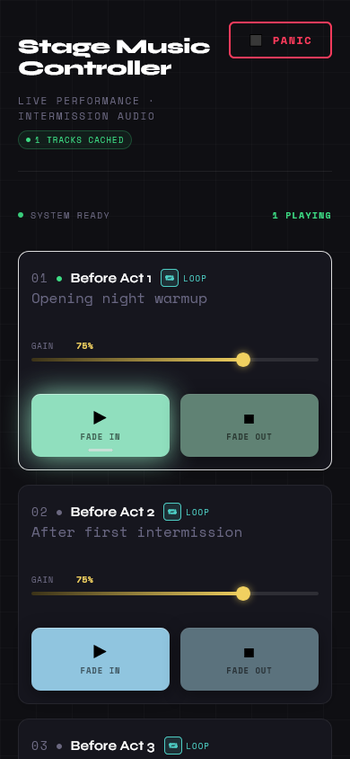

FADED MPC
==============

[](https://github.com/o-bardiuk/faded-mpc)

# Stage Music Controller

A single-file HTML app for live performance sound engineers. Designed to start and stop background/intermission music gradually between acts — no DAW, no complex setup, just open the file and go.

---

## What it does

The app presents a set of **pad pairs** — one pad per track to fade the music in, one to fade it out. All transitions are gradual (configurable fade durations), so there are no abrupt cuts during a live show.

A **PANIC** button at the top right instantly stops all tracks simultaneously in case of emergency.

---

## Features

### Pads
- Each audio track gets two MPC-style pads: **Fade In** (▶) and **Fade Out** (■)
- Pressing Fade In starts the audio and smoothly raises volume over the configured duration
- Pressing Fade Out smoothly lowers volume to zero, then stops playback
- Pressing Fade In on an already-playing track does nothing (won't restart or double-trigger)
- Pressing Fade Out on an already-fading-out track does nothing (won't restart the fade)
- Each pad pair is color-coded in a unique pastel tone; the stop pad is a darker desaturated variant of the play pad
- A **fade progress bar** on the play pad shows how far into the fade-in the track is
- A **FADING IN / FADING OUT** badge appears on pads while a transition is active

### Per-track controls
- **Gain slider** — sets the maximum volume level (0–100%) independently per track. The fade multiplies against this value, so a track at 50% gain will fade in to 50% volume, not 100%
- **Loop checkbox** — toggles whether the audio loops continuously or plays once and stops. Label reads "Loop" (teal) or "Once" (dim) to make state obvious at a glance

### Track labels
- Each track has a name (e.g. "Before Act 3") and a track number, visible at all times
- A small colored dot next to the track number shows audio cache status: loading (yellow pulse), ready (green), or failed (red)

### Status indicators
- **Active count** in the top status bar shows how many tracks are currently playing
- **VU meter** (three animated bars) appears on a track card while that track is playing
- **Cache pill** in the header shows overall preload status (e.g. "9 tracks cached")
- **Toast messages** confirm every action (fade in, fade out, loop toggle, panic) without requiring eyes off the board

---

## Audio preloading

The app preloads all audio files on startup before unlocking the controls. The "Enter" button only appears once all tracks are ready.

**Two modes are selected automatically:**

| Environment | Strategy | Effect |
|---|---|---|
| `http://` / `https://` (web server) | `fetch()` + Blob URL | Entire file downloaded into RAM — internet can disappear after load |
| `file://` (local file, no server) | `Audio` + `canplaythrough` | Browser reads local file natively — no CORS restrictions |

A per-track progress bar shows download/buffering progress during the loading screen. If any track fails to load, it is marked with ✗ in red and the engineer is warned but not blocked from entering.

---

## Responsive layout

| Screen | Layout |
|---|---|
| Desktop | Track label + gain slider + pad pair in a single horizontal row |
| Tablet | Same row layout, slightly narrower pads |
| Mobile | Stacked — label and loop on top, gain slider below, two pads side by side at full width |

---

## Configuration

Everything is set in the `CONFIG` object at the top of the `<script>` section. No UI settings exist intentionally — the interface shows only what the sound engineer needs during a show.

```js
const CONFIG = {
  fadeInDuration:  4.0,   // seconds for fade in
  fadeOutDuration: 5.0,   // seconds for fade out
  fadeStep:        50,    // ms between volume steps (lower = smoother)

  tracks: [
    {
      name: "Before Act 1",      // label shown on the pad card
      url:  "./audio/act1.mp3",  // path to audio file (relative or absolute)
      color: { h: 155, s: 55, l: 72 },  // HSL pastel color for this pad pair
    },
    // … add as many tracks as needed
  ]
};
```

- Set `url: null` for any track to run in **demo mode** (all visual animations work, no audio plays)
- Add or remove objects in the `tracks` array — the number of pad cards is generated automatically
- Each `color` is an HSL value; the stop pad is automatically derived as a darker/desaturated variant

---

## Usage

1. Edit `CONFIG.tracks` — add your track names and audio file paths
2. Open `index.html` in a browser (locally or via a web server)
3. Wait for the preload screen to finish — all tracks will be buffered
4. Click **Enter** when ready
5. During the show: hit the **▶ Fade In** pad before each act's intermission music should start; hit **■ Fade Out** when it's time to stop

---

## File structure

The entire app is a single self-contained `.html` file — no dependencies, no build step, no npm. Copy it anywhere, add your audio files, open in a browser.

```
your-folder/
├── index.html        ← the app
└── audio/
    ├── act1.mp3
    ├── act2.mp3
    └── …
```

---

## Browser compatibility

Works in all modern browsers (Chrome, Firefox, Safari, Edge). Requires JavaScript enabled. Audio format support depends on the browser — MP3 is universally supported; OGG and WAV also work.

> **Note for local use:** Open the `.html` file directly from your filesystem (`file://`). No web server needed. The app detects this automatically and switches to a CORS-safe audio loading strategy.

